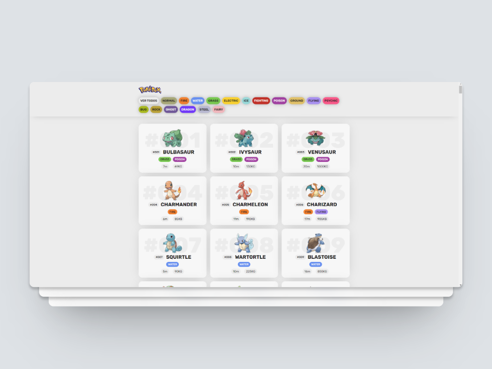

  
  
  

  <h3>¡Hey! I'm Emilio Rodríguez👋🏼</h3>
  
  
  

 

  <em>Software Engineer at <a href="https://somosdual.org/">University Invenio</a>
    
     
    <strong>Frontend Developer</strong> | React | Node | Typescript
    
  </em>

I am a student of Information Technology, passionate about web and mobile development, with high expectations for learning. I am a very polite and respectful person, always willing to help and learn. As a web developer, my main expertise lies in the client-side, using the React framework. Additionally, I have skills on the server-side, utilizing Node.js.

## Projects

<table align="center">
  <tr>
    <th>
      <a href="https://emiliojrb26.github.io/Pokedex/" target="_blank">
        Pokédex
      </a>
    </th>
  </tr>

  <tr>
    <td align="center">
      
       
      <a href="https://emiliojrb26.github.io/Pokedex/">
        <strong>View project</strong>
      </a>
      &nbsp;&nbsp;
      <a href="https://github.com/emiliojrb26/Pokedex">
        <strong>Repository</strong>
      </a>
    </td>
  </tr>
</table>
